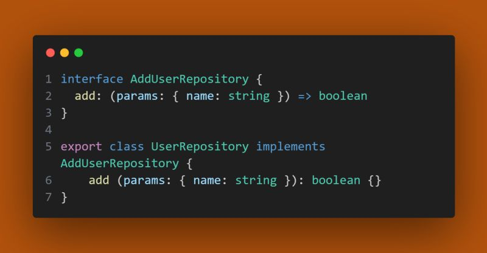

🇧🇷 Hoje vou tentar simplificar a letra I do SOLID (Interface Segregation).

Objetivo:

- Tornar suas interfaces específicas para que seus clientes implementam métodos que sejam do seu interesse.

- Ou seja, a classe não deveria implementar métodos que não serão usados. Para isso basta você definir uma interface enxuta cujo faça coesão com a implementação.

Abaixo uma implementação coesa:

